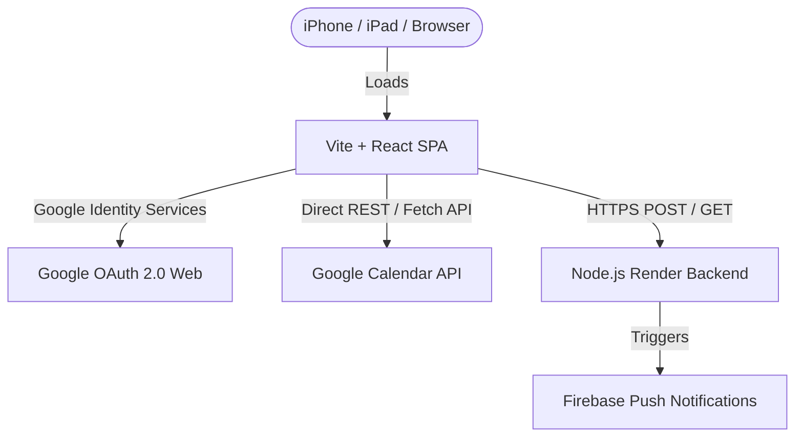
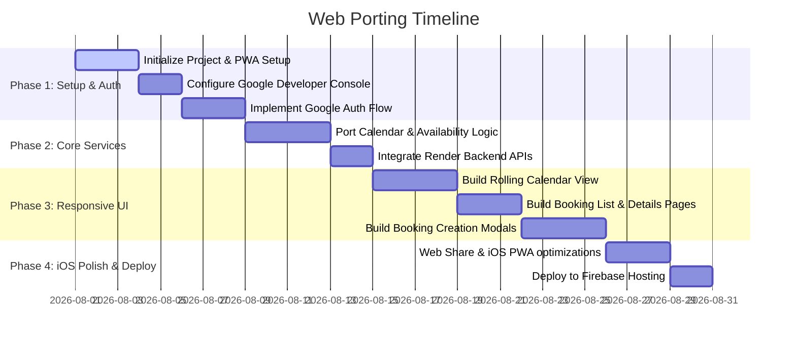

# Porting Plan: Vasantshrushti Farm Booking Scheduler (Web Port)

This plan outlines the architecture, technology stack, and step-by-step implementation guide to port the Android **VSBookingScheduler** app to a web application. The goal is to make it fully accessible, secure, and responsive on iOS devices (iPhones and iPads) as well as desktop browsers.

---

## 1. Architectural Overview & Migration Mapping

The Android app relies on a serverless client-side architecture where **Google Calendar acts as the database**, and a Node.js server (hosted on Render) triggers push notifications and compiles booking summaries. The web port will preserve this architecture, replacing Android-specific APIs with standard Web APIs:



### Mapping Android Components to Web Standards

| Android Feature | Android Technology | Web Port Implementation |
| :--- | :--- | :--- |
| **Authentication** | Google Sign-in (`play-services-auth`) | **Google Identity Services (GIS)** SDK for Web (`accounts.google.com/gsi/client`) + OAuth2 Implicit/Authorization flow. |
| **User Authorization** | Email checking (`ApprovedPerson.kt`) | Shared TypeScript Enum verifying email string inside Google Token payload. |
| **Calendar Services** | Google Calendar Java Client | **Google Calendar REST API** via direct `fetch` calls (with OAuth2 bearer tokens). |
| **Availability Engine** | `freebusy.query()` client methods | REST API call: `POST https://www.googleapis.com/calendar/v3/freeBusy`. |
| **Monthly summary counts** | `RenderService.getBookingSummary` | Fetch request calling the existing Render API `/bookingsSummary`. |
| **Rolling Calendar UI** | ScrollView containing custom `MonthView`s | Responsive CSS Grid layout with lazy-loading infinite scroll container. |
| **Receipt Sharing** | Android Intent Share | **Web Share API** (`navigator.share()`) for native sharing to WhatsApp, Messages, or Mail on iOS. |
| **Application Updates** | APK Download & Install via Render Server | **Progressive Web App (PWA)** auto-updates upon reload (fully bypasses App Store / TestFlight issues). |

---

## 2. Technology Stack Selection

To ensure the web app is fast, looks premium, and works natively on iOS, we recommend:

1. **Framework**: **Vite + React + TypeScript**
   - **Vite** offers sub-second start and builds times, hot module replacement, and compiles to a lightweight Single Page Application (SPA).
   - **TypeScript** will allow us to port current Kotlin DTOs (`BookingDetails.kt`, `Accommodation.kt`) with exact compile-time safety.
2. **Styling & UI Components**: **Tailwind CSS + shadcn/ui** (or Tailwind + Radix UI primitives)
   - Fast, highly customizable responsive grid layouts.
   - Smooth animations, modern inputs, date pickers, and modals optimized for touch targets (crucial for iOS).
3. **Platform-Adaptive UI Styling**:
   - We will implement a runtime detection hook (`usePlatform()`) that dynamically applies a platform theme to the web app:
     - **iOS Theme (`theme-ios`)**: Renders components with Cupertino design language (system font *San Francisco*, rounded iOS-style bottom action sheets, sliding toggle switches, native iOS wheels for time frames, blue tinted button styles, and top/bottom navigation bars).
     - **Android Theme (`theme-android`)**: Renders components with Material Design language matching the native Android app (system font *Roboto/Product Sans*, standard Material Design inputs, Floating Action Buttons (FAB), ripple click effects, and centered dialog panels).
     - **Desktop/Web Theme (`theme-web`)**: A clean, premium desktop calendar scheduler grid optimized for large screen sizes, hover effects, and keyboards.
4. **State Management**: **React Query (TanStack Query)**
   - Automatically handles caching, background revalidation, and loading states for Google Calendar API calls (vital for mobile network stability).
5. **Build/Deployment**: **PWA (Progressive Web App)**
   - Use `vite-plugin-pwa` to generate a manifest and service worker.
   - Users can click "Add to Home Screen" on Safari (iOS), which removes the browser address bar and allows it to run in full-screen mode like a native app.


---

## 3. Step-by-Step Implementation Roadmap



### Phase 1: Setup & Website Integration

1. **Vasantshrushti Website Integration**:
   - Create the Vite + React + TS project inside a subdirectory: `/Users/adityamhatre/projects/Vasantshrushti-Website/scheduler-src`.
   - Configure `scheduler-src/vite.config.ts` to output production files to the parent-relative directory `../scheduler` by setting the `build.outDir` configuration.
   - Configure the base path in `vite.config.ts` to `base: '/scheduler/'` so assets (CSS, JS) are fetched from `/scheduler/` on the live site.
2. **Firebase Hosting Configuration**:
   - Update the existing [/Users/adityamhatre/projects/Vasantshrushti-Website/firebase.json](file:///Users/adityamhatre/projects/Vasantshrushti-Website/firebase.json) to configure Single-Page Application (SPA) routing for the subfolder, mapping any path under `/scheduler/**` to `/scheduler/index.html` to prevent 404s when using React Router:
     ```json
     "rewrites": [
       {
         "source": "/scheduler/**",
         "destination": "/scheduler/index.html"
       }
     ]
     ```
3. **Google Cloud Console Configuration**:
   - Create a Web OAuth Client ID in the Google Cloud Console.
   - Add authorized Javascript Origins (e.g., `http://localhost:5173`, `https://website-cb4cb.web.app`, and `https://vasantshrushti.com`).
4. **Google Sign-In Implementation**:
   - Integrate the Google Identity Services SDK: `<script src="https://accounts.google.com/gsi/client" async defer></script>`.
   - Implement authorization flow to acquire an `access_token` with the `https://www.googleapis.com/auth/calendar` scope.
   - Validate token and user email against the authorized email list (`ApprovedPerson`). Save the token in `localStorage`.

### Phase 2: Google Calendar & Backend Integration

1. **Port Data Models**:
   - Convert Kotlin classes `BookingDetails`, `AdvancePayment`, `Accommodation`, and `PaymentType` to TypeScript types.
2. **Implement Calendar API Client**:
   - Write a module (`src/services/calendarService.ts`) with functions:
     - `checkAvailability(timeMin, timeMax)`: Performs a `POST` to `https://www.googleapis.com/calendar/v3/freeBusy` using calendar IDs.
     - `createBooking(bookingDetails)`: Sends a `POST` insert request. In multi-accommodation bookings, insert events into each calendar, linking them using `extendedProperties.private.id`.
     - `updateBooking(bookingDetails)`: Patch request to update event descriptions and summaries.
     - `deleteBooking(bookingDetails)`: Delete requests for linked events.
     - `getBookings(startDate, endDate)`: List events and parse their descriptions as JSON `BookingDetails` payloads.
3. **Render Server Service Integration**:
   - Setup a `renderService.ts` to call `https://vs-booking-scheduler-push-notify-server.onrender.com`.
   - Call `/bookingsSummary` to fetch monthly numbers.
   - Trigger notifications using POST calls on `/notifications/newBookingCreated`, `/notifications/updatedBooking`, and `/deleteBooking`.
   - Update the local backend codebase at `/Users/adityamhatre/projects/VSBookingSchedulerNotificationServer` to enable Cross-Origin Resource Sharing (CORS).

### Phase 3: Responsive User Interface

1. **Main Screen (Rolling Calendar)**:
   - Create a scrolling layout displaying a calendar grid.
   - Pull monthly count indicators from the Render API.
   - Auto-scroll to the current month on mount.
   - Support clicking a month (to view all bookings) or a date (to view date bookings).
2. **Booking List Screen**:
   - Render a list of booking cards for the selected month/date.
   - Highlight guest name, booking date/time, accommodations selected, amount, and advance payment status (cash, cheque, etc.).
   - Support deleting (with warning dialog) or editing bookings.
3. **Timeframe & Availability Input**:
   - Add a form to pick check-in and check-out dates/times.
   - Support "One Day Booking" presets (9:30 AM – 5:00 PM and 4:00 PM – 11:55 PM).
   - Query available rooms and present them as interactive checkboxes.
   - Add shortcuts: "Whole resort" (Select All), "Bungalow & Rooms", and "Bungalow 5+1" (which aggregates Bungalow 3+1, Special Room 1, and Special Room 2).
4. **Booking Details Form**:
   - Capture guest name, phone number, headcount, advance payment details, and optional notes.
   - Auto-calculate or input details, perform form validation, and save to calendar.

### Phase 4: Mobile-Specific Optimizations (iOS) & Backend Changes

1. **Backend Server Updates**:
   - Install `cors` npm package in `/Users/adityamhatre/projects/VSBookingSchedulerNotificationServer`.
   - Import and use `cors()` middleware in `/Users/adityamhatre/projects/VSBookingSchedulerNotificationServer/app.js`.
2. **Web Share API**:
   - Wire the "Share" button to `navigator.share()` to trigger iOS's native share sheet, allowing immediate sharing of receipts to WhatsApp contacts.
3. **PWA Enhancements**:
   - Set up `theme-color` meta tags, high-resolution home screen icons, and Apple startup splash screens.
   - Force full-screen display by setting `<meta name="apple-mobile-web-app-capable" content="yes">`.
4. **Deployment**:
   - Deploy by running `firebase deploy` in the `/Users/adityamhatre/projects/Vasantshrushti-Website` directory. Both the static landing pages and the new scheduler web app will be pushed together to Firebase Hosting completely free!

---

## 4. Key Design Details & Code Adaptations

### PWA Manifest Configuration (`public/manifest.json`)
```json
{
  "name": "Vasantshrushti Farm Booking Scheduler",
  "short_name": "VS Booking",
  "start_url": "/",
  "display": "standalone",
  "orientation": "portrait-primary",
  "background_color": "#121212",
  "theme_color": "#121212",
  "icons": [
    {
      "src": "/icons/icon-192.png",
      "type": "image/png",
      "sizes": "192x192"
    },
    {
      "src": "/icons/icon-512.png",
      "type": "image/png",
      "sizes": "512x512",
      "purpose": "any maskable"
    }
  ]
}
```

### Direct Google Calendar REST Fetch Example (TypeScript)
```typescript
async function checkAvailability(accessToken: string, timeMin: string, timeMax: string, calendars: string[]) {
  const response = await fetch("https://www.googleapis.com/calendar/v3/freeBusy", {
    method: "POST",
    headers: {
      "Authorization": `Bearer ${accessToken}`,
      "Content-Type": "application/json"
    },
    body: JSON.stringify({
      timeMin,
      timeMax,
      timeZone: "Asia/Kolkata",
      items: calendars.map(id => ({ id }))
    })
  });
  
  if (!response.ok) throw new Error("Failed to check availability");
  
  const data = await response.json();
  // Return list of available calendar IDs (where 'busy' list is empty)
  return Object.entries(data.calendars)
    .filter(([_, value]: [string, any]) => value.busy.length === 0)
    .map(([key]) => key);
}
```

### Backend CORS Configuration Diffs

In [package.json](file:///Users/adityamhatre/projects/VSBookingSchedulerNotificationServer/package.json):
```diff
   "dependencies": {
     "@js-joda/core": "^3.2.0",
     "body-parser": "^1.19.0",
+    "cors": "^2.8.5",
     "express": "^4.17.1",
     "firebase-admin": "^9.4.2",
```

In [app.js](file:///Users/adityamhatre/projects/VSBookingSchedulerNotificationServer/app.js):
```diff
 import express from 'express';
+import cors from 'cors';
 import admin from 'firebase-admin';
 import bodyParser from 'body-parser'
 import { v4 as uuidv4 } from 'uuid';
 
 const app = express()
+app.use(cors())
 const jsonParser = bodyParser.json()
```

---

## 5. Potential Constraints & Solutions

1. **Google OAuth Token Lifespan (Client-Side Flow)**:
   - *Problem*: OAuth access tokens expire after 1 hour. Re-entering credentials hourly on mobile is tedious.
   - *Solution*: Request a refresh token using Google's Authorization Code Flow (requiring a tiny backend function or exchanging code on the client using offline access) or use Google Identity Services token client with an auto-refresh timer.
2. **CORS Configuration on the Render Backend**:
   - *Problem*: The existing Render server restricts requests from browsers because CORS isn't enabled.
   - *Solution*: Enable CORS middleware on the Node.js server using the changes planned in Phase 4.
3. **iOS-Specific UI Quirks**:
   - *Problem*: Safari adds rubber-banding scrolling and handles click delays on touch inputs.
   - *Solution*: Use touch-action styles (`touch-action: manipulation`) and responsive component libraries that handle iOS touch events natively.
